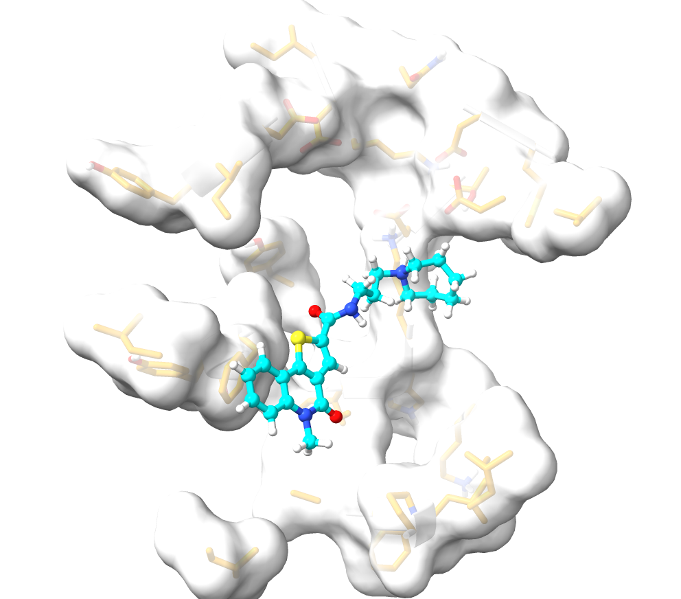

# When-Patterns-have-little-or-no-Meaning

In the age of machine learning, coupled with the explosion of chemo-biological data from MD simulations, the goal is to leverage these to understand key drivers of changes, binding, and catalysis at the macromolecular level.

*In the study by [Brownless et. al. 2025;](https://doi.org/10.1021/acs.jpcb.4c08824) machine learning was used to characterize the most important residues that drive interactions between two corona virus variants (SARS-CoV and SARS-CoV2) and their biological target (ACE2 receptor).*

Even though the authors strongly believes that such technique could be extended to other possible protein-receptor interactions, **I decided to try it out on Ligand-protein interactions.**

What key residues are responsible for binding/conformational changes upon ligand binding--- that can be used to differentiate bound vs unbound conformations.

The data used here is from a malaria study **(unpublished)**, where we performed 400ns simulations of the apo and MMVMMV019313-bound bifunctional farnesyl/geranylgeranyl pyrophosphate synthase (FPPS/GGPPS) from *Plasmodium falciparum* (PDB ID: [9NSR](https://www.rcsb.org/structure/9NSR)). The dataset for this exercise as described below is large and so, will not be added to this repository. You can request it by sending an email **[here](Shadrachchinecheremeze@gmail.com)**

**Here is the hypothesis:**

*Fluctuations and changes in the position of residues around the active site can model the differences between a bound and unbound conformation. This fluctuations can be tracked by the **per-atom distances** between all possible residue-atom combinations of residues within a cut-off distance from the ligand around the active site. How close these atoms are, and changes in this closeness can be easily captured with distances*

To get the data, I defined the set of all **residues within 8Å** from the ligand:

```text
RES_INPUT="63-73,97-98,100-112,117-118,138,169-170,172-178,180-181,218,221-235,258,261-273,287-292,366-367,369-378"
```

And the set of all heavy atoms that may interact with each other:

```text
ATOMS=ATOMS <<< "N,CA,C,O,CB,CG,CD,CE,CZ,NE,NE1,NE2,NZ,OE1,OE2,OD1,OD2,SG,SD,CG1,CG2,CD1,CD2,ND1,ND2,NH1,NH2,OG,OG1,OH,CH2"

```

Then I sought to generate unique pairs of each of the residues and the atoms using this [bash file](files/residue-atom-pair-generator.sh). Next was to generate a list of distance between pairs, of all the residue-atom lists in a unidirectional way (A→B same as B→A) into *pair_generated.in* file. A crosssection looks like this:

```text
distance d_63_CD_100_CG1 :63@CD :100@CG1 out d_63_CD_100_CG1.dat
distance d_63_CD_100_CG2 :63@CD :100@CG2 out d_63_CD_100_CG2.dat
distance d_63_CD_100_CD1 :63@CD :100@CD1 out d_63_CD_100_CD1.dat
.....
```
This was used as the input file for the cpptraj command of ambertools. Due to the massive size of this file (containing a possible 1.8 million distances), it was feed into cpptraj at 5000 lines per time (corresponding to 350+ cycles) using this [script](files/distance_compute.sh). These data were merged and converted into csv files.

**Concerning our trajectory**; 400ns simulation corresponds to 200000 frames at NTWRX=1000. So, we parsed it at a stride of 20 to give a total of 10,000 frames (or data points)

To further reduce the size of the dataset, every 10th datapoint was sampled from each of the bound and unbound datasets and pooled together to give data consisting of 2000 rows only. Since most of the atom-pairs are not present in some residues, we came down to 200K+ possible distances (columns or descriptors). Also, we selected only CA and CB distances between residues, thereby reducing our column length down from 1.8 million. To combine this dataset, we defined a new column (State) with categorical variables of "bound" and "unbound" to depict the apo and MMV-bound states. 

Then this dataset was used as input in our machine learning study. Most of the codes and methodology we will apply below are simple aplication of codes used by [Brownless et. al. 2025;](https://doi.org/10.1021/acs.jpcb.4c08824)


Load modules and read in the dataset
```python

import pandas as pd
import matplotlib.pyplot as plt
import seaborn as sns
import numpy as np
import os
import sys
import time
import re


df = pd.read_csv('/path-to-your-file/Full_dataset_Apo_MMV.csv')
```

As already mentioned, to reduce the size of the dataset, we selected only CA and CB distances. Also, to handle missing values (empty cells), we filled the "NAN" with 50Å. The rational for this is that such large distances are impossible (since maximum feasible distance would be around 16-20Å) and depict that no such interactions exist. This choice will also be clear later when we adopt the concept of **Residue Importance** used in the main work.

```python
#Select only columns with CA and or CB distances

import re
pattern = re.compile(r"^d_.*_(CA|CB)_.*_(CA|CB)$")
cols = [col for col in df.columns if pattern.match(col)]
cols.append("State")

filtered_df = df[cols]
df_full = filtered_df.fillna(50)
df_full.isna().sum().sum()
df_full.isna().sum().sort_values(ascending=False)
```

To make progress, we removed the last column (STATE) and normalized the dataset using Z-score

```python
# Separate features and labels
df_features = df_full.iloc[:, 1:-1]  # Middle columns = residue features
df_labels = df_full.iloc[:, -1]      # Last column = Cluster/State labels

# Process features only (inverse + z-score) + normalization
df_features_numeric = df_features.select_dtypes(include=['float64'])
df_importance = 1 / df_features_numeric
df_scaled = (df_importance - df_importance.mean(axis=0)) / df_importance.std(axis=0)
```

Then we recombine the datasets for ML training
```python
df_ml_ready = pd.concat([df_scaled, df_labels], axis=1)
print("ML ready shape:", df_ml_ready.shape)
print("Features:", df_scaled.shape[1], "Labels:", df_labels.name)
```

**Correlation Matrix and Feature size Reduction**

We will visualize the correlation matrix of dataset inorder to remove highlighly correlated features
```python
#pull out all features from the dataframe (everything except for the last ID column)

features_pre = df_ml_ready.iloc[:,:-1]
print('# of features before drop:', features_pre.shape[1]+1)
```

**Before Filtering**
```python
# features_pre: your feature-only DataFrame (no labels)
corr_matrix_before = features_pre.corr(min_periods=1).abs()
cutoff = 0.9

fig, ax = plt.subplots(1, figsize=(4,4), tight_layout=True)
im = plt.imshow(corr_matrix_before, interpolation='nearest', origin='lower')
cbar = ax.figure.colorbar(im, shrink=0.7, label='Absolute correlation')
```

**Filtering**
```python
#shuffle corr_matrix
arr = np.arange(len(df_ml_ready.columns)-1)
np.random.shuffle(arr) 
corr_matrix = corr_matrix_before.iloc[arr,arr]

#select upper triangle of correlation matrix to avoid duplicates in pairs
upper = corr_matrix.where(np.triu(np.ones(corr_matrix.shape), k=1).astype(bool))

#drop highly correlated features based on set threshold
to_drop = [column for column in upper.columns if any(upper[column] > cutoff)]
df_dropped = df_ml_ready.drop(columns = to_drop)
print('Number of features after drop is:', df_dropped.shape[1]+1)
```
**After Filtering**
```python
features_postcorr = df_dropped.iloc[:,:-1]
corr_matrix_after = features_postcorr.corr(min_periods=1).abs()

fig, ax = plt.subplots(1, figsize=(4,4), tight_layout=True)
im = plt.imshow(corr_matrix_after, interpolation='nearest', origin='lower')
cbar = ax.figure.colorbar(im, shrink=0.7, label='Absolute correlation')
```
You can see the correlation matrix [before](/Images/Correlation_Before.png) and [after](/Images/Correlation_After.png) filtering here

Extract the names of all the residues from the column heads and store them as strings
```python
def extract_residues(colname):
    match = re.match(r"d_(\d+)_.*_(\d+)_.*", colname)
    if match:
        return int(match.group(1)), int(match.group(2))
    return None, None
for col in df_dropped.columns:
    r1, r2 = extract_residues(col)
    print(col, "→", r1, r2)
residues = set()
for col in df_dropped.columns:
    r1, r2 = extract_residues(col)
    if r1 is not None:
        residues.add(r1)
        residues.add(r2)
residues = sorted(residues)
len(residues)
print(residues)
```
```text
[63, 64, 65, 66, 67, 68, 69, 70, 71, 72, 73, 97, 98, 100, 101, 102, 103, 104, 105, 106, 107, 108, 109, 110, 111, 112, 117, 118, 138, 169, 170, 172, 173, 174, 175, 176, 177, 178, 180, 181, 218, 221, 222, 223, 224, 225, 226, 227, 228, 229, 230, 231, 232, 233, 234, 235, 258, 261, 262, 263, 264, 265, 266, 267, 268, 269, 270, 271, 272, 273, 287, 288, 289, 290, 291, 292, 366, 367, 369, 370, 371, 372, 373, 374, 375, 376, 377, 378]
```
**Residue Importance (RI)**

Residue importance defines how significant the residue is in differentiating the bound and unbound conformations

This gives you the biologically meaningful answer: which residues drive the difference between unbound (apo) and bound (mmv). The meaningful output is a single residue‑importance profile that tells you which residues contribute most to distinguishing unbound from bound.

We will create dataframes to store these residue importances. Since we will use three models (Random Forest, Logistic Regressor and MLP), we will have six dataframes (to cover the bound and unbound). However, the dataframes for the bound and unbound states in each model will return exactly same thing since RI is not assignable to either of the two states.

```python
LR_impo_res_apo=pd.DataFrame(columns = residues)
RF_impo_res_apo=pd.DataFrame(columns = residues)
LR_impo_res_mmv=pd.DataFrame(columns = residues)
RF_impo_res_mmv=pd.DataFrame(columns = residues)
mlp_impo_res_apo=pd.DataFrame(columns = residues)
mlp_impo_res_mmv=pd.DataFrame(columns = residues)
```
We will re-assign the State labels (bound vs unbound) to (0 vs 1)
```python
df_dropped['State'] = df_dropped['State'].replace({'Unbound': 0, 'Bound': 1})
df_dropped['State'] = df_dropped['State'].astype(int)
df_dropped['State'].unique()
```

**The rest of the code for the model training and evaluation is available [here](Link)**

**The performance of models** 


**Residue Importance plots**

After the training, we can visualize the mean residue performance for each residue across the frames, for all the models

```python
LR_impo_res_mmv.mean().plot(figsize = (10,4), linewidth=2.0, color= 'red', label='LR')
RF_impo_res_mmv.mean().plot(figsize = (10,4), linewidth=2.0, color='orange', label='RF')
mlp_impo_res_apo.mean().plot(figsize = (10,4), linewidth=2.0, color = 'black', label='MLP')
plt.xlabel('Residue number', fontsize=12, fontweight='bold')
plt.ylabel('Residue importance', fontsize=12, fontweight='bold')
plt.legend(frameon=True, edgecolor='k', framealpha=1)
plt.savefig('Residue_importance.png', dpi=200, bbox_inches='tight')
```


**The most Important Residues**

We can get a sumary of the most important residues and possibly rank them

```python
imp = LR_impo_res_apo.mean()
omp = RF_impo_res_apo.mean()
amp = mlp_impo_res_apo.mean()
top_lr  = imp.sort_values(ascending=False).head(15)
top_rf  = omp.sort_values(ascending=False).head(15)
top_mlp  = amp.sort_values(ascending=False).head(15)
all_res = sorted(set(top_lr.index).union(top_rf.index).union(top_mlp.index))
table = pd.DataFrame(index=all_res, columns=["LR_importance", "RF_importance"])
table.loc[top_lr.index, "LR_importance"] = top_lr.values
table.loc[top_rf.index, "RF_importance"] = top_rf.values
table.loc[top_mlp.index, "MLP_importance"] = top_mlp.values
```
So, we are down from 77 residues to 30 most important residues 
```text
97,106,108,111,112,169,172,180,181,218,223,224,225,227,232,233,234,258,263,264,265,271,272,273,287,288,290,292,367,374
```
**Findings and Implications**

Lets first visualize the most important residues of the protein with the ligand bound



Since this is a distance based derived importance, it most likely **captured the residues just next to the ligand in the active site**. It is possible that these residues experienced the most fluctuations during the binding episode. **However, how much insight can be derived from this is not still very clear.**

**Another thing to note is that, it was able to cappture PHE265 involved in significant pi-pi interactions with the bicyclic ring of MMV. Also, it included ASP108 which formed a strong salt bridge with the charged piperidine ring of MMV (All these have been observed in our simulations)**

